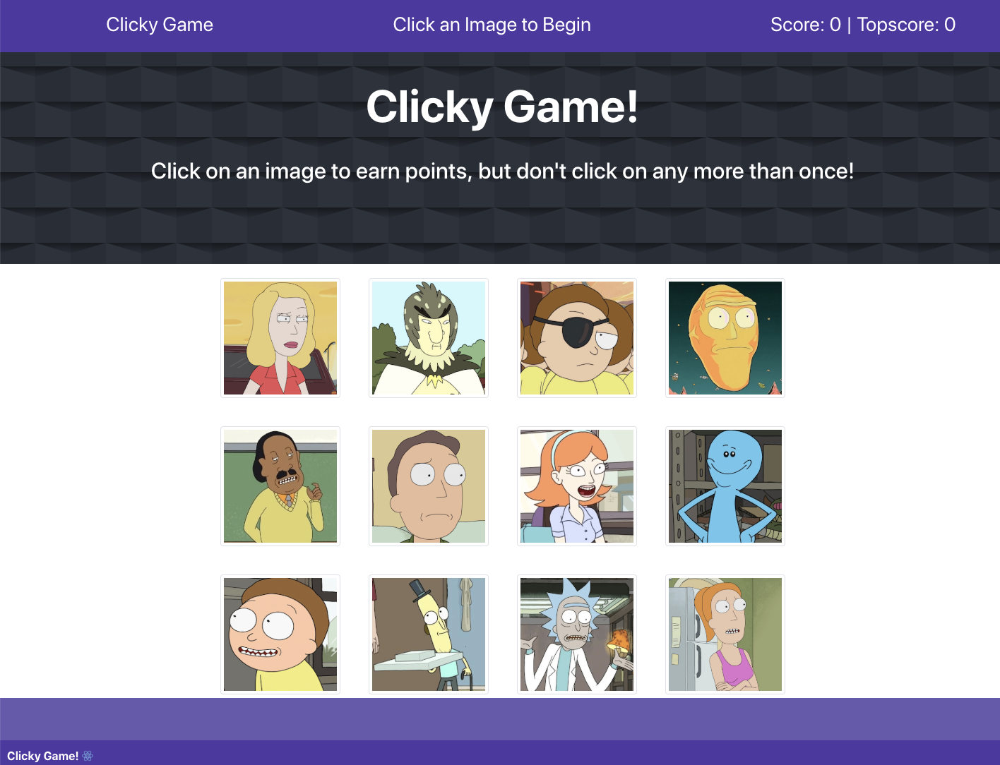

# Project Title

**Clicky - A React App**

## Description:

Test your memory! Click on a different image each time and try to get all 12!

### Installing

* Clone this repository
* Run npm init -y
* Run npm install

## Built With
* This project was bootstrapped with [Create React App](https://github.com/facebook/create-react-app)
* React.js
* JSX
* Javascript
* Node.js
* Bootstrap 4

The app uses the following NPM packages: 

### NPM Packages

* react  - React.js framework
* react-dom - React DOM manipulation

## Instructions

* Clone this repository at https://github.com/lmasullo/clicky
* Run npm install in the terminal
* Run NPM start
* Open your browser to localhost:3000
* You will be presented with the main page
* Alternately go to https://lmasullo.github.io/clicky/

* The goal is to click on each image just once. As you click on an image your score will increment as long as you haven't clicked on it before. Try to get all 12! If you click on an image a second time, the images will shake, and the game will restart.

## GitHub Repo
https://github.com/lmasullo/clicky

## Versioning

We use [SemVer](http://semver.org/) for versioning. 
Current version is 1.0

## Authors

**Larry Masullo (sole author)**

## Portfolio
https://www.masullodev.com

## License

This project is licensed under the MIT License - see the [LICENSE.md](LICENSE.md) file for details

## Acknowledgments

Thanks to the Instructors and Teaching Assistants in the UT Full Stack Coding Bootcamp for their support. 
